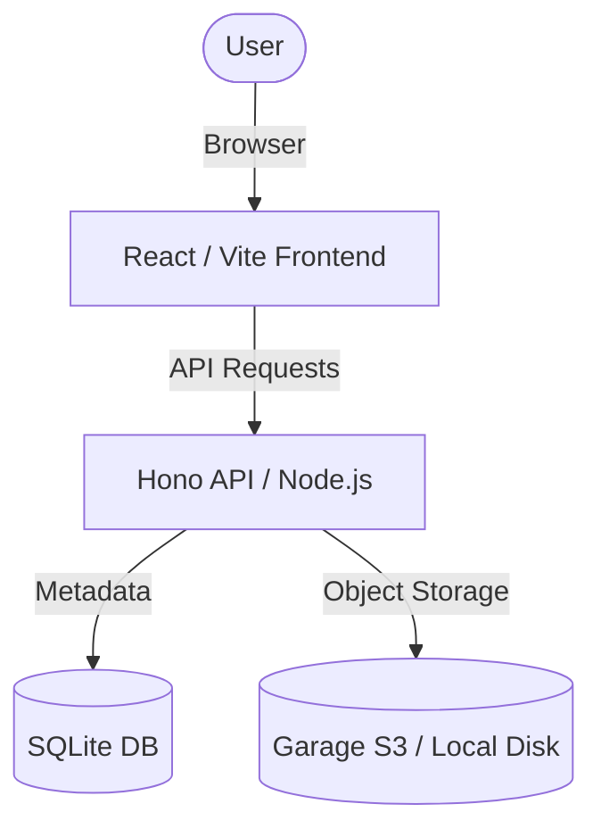

# DropImg

<div align="center">


**A lightweight, clean, and Docker-first self-hosted image hosting application.**

[](LICENSE)
[](https://github.com/matija2209/dropimg/stargazers)
[](https://github.com/matija2209/dropimg/issues)
[](https://nodejs.org/)
[](https://www.docker.com/)

[Quick Start](#quick-start) • [Features](#features) • [Roadmap](ROADMAP.md) • [Architecture](#architecture) • [Development](#development) • [Contributing](#contributing)

</div>

---

**DropImg** is built for simplicity and speed. It allows you to drag, drop, or paste images to get instant public URLs for sharing. It follows a modern "single app" architecture, combining a React frontend with a Hono backend, backed by SQLite for metadata and S3-compatible storage (Garage) for files.

## Roadmap

We have an ambitious plan to evolve DropImg into a production-ready image platform. Key future features include:
- **AI Image Naming:** SEO-friendly name generation using LLMs.
- **Rate Limiting:** IP and endpoint-based usage controls.
- **BullMQ Background Jobs:** Asynchronous processing for long-running AI tasks.
- **Privileged Access:** Super admin controls and operation monitoring.

Check out the full [**ROADMAP.md**](ROADMAP.md) for details on our phases and priorities.

---

## Quick Start

DropImg is designed to be deployed with **zero local dependencies**. You do NOT need Node.js, npm, or a database installed on your VPS. Docker handles everything.

### Prerequisites
- A Linux VPS (Ubuntu/Debian recommended)
- `git` and `curl` installed

### One-Click Installation
```bash
git clone https://github.com/matija2209/dropimg.git
cd dropimg
./install.sh
```

### What the script does:
1. **Docker Check:** Automatically installs Docker and Docker Compose if they aren't found.
2. **Interactive Configuration:** Prompts you for App Name, Port, Public URL, and Admin Token.
3. **Authentication Choice:** You can choose between a private setup (User Auth + Admin Access) or a Public Mode (No mandatory login).
4. **Storage Provisioning:** Initializes **Garage S3**, creates the `dropimg` bucket, and generates access keys.
5. **Environment Setup:** Creates a `.env` file with all your settings.
6. **Launch:** Starts all containers in the background.

Once finished, your app will be live at the URL you configured!

### Public Mode (No Authentication)
During installation, you can choose to disable authentication. In **Public Mode**:
- Anyone can upload images without an account.
- The gallery is shared and shows all images uploaded anonymously.
- Administrative tasks (like deletion) can still be performed using the `ADMIN_TOKEN`.

### Uninstallation
To remove the application and stop all services:
```bash
./uninstall.sh
```

**CLI Options:**
- `./uninstall.sh --yes`: Non-interactive, deletes **everything** (containers, data, and config).
- `./uninstall.sh --keep-data`: Non-interactive, stops services but **preserves** all files.

### Updating
To update DropImg to the latest version while preserving your data:

1. **Pull the latest changes:**
   ```bash
   git pull origin main
   ```
2. **Rebuild and restart:**
   ```bash
   docker compose up --build -d
   ```

*Note: Database migrations are applied automatically by the API service on startup. Your existing S3 credentials and database will be preserved.*

---

## Features

- **Multi-User Support:** Built-in authentication with support for both Admin and Regular users.
- **Private Galleries:** Every user has their own private gallery. You only see what you upload.
- **Admin Dashboard:** Privileged access to view and manage all images across the entire platform.
- **Instant Upload:** Support for Drag & Drop and Clipboard Paste.
- **Built-in Image Tools:** Compress JPGs or convert PNGs to JPG directly from the uploader.
- **Modern Stack:** React 19, Vite 8, Hono, and Tailwind CSS 4.
- **S3-Compatible Storage:** Built-in integration with [Garage](https://garagehq.deuxfleurs.fr/).
- **SQLite + Drizzle:** Zero-config metadata storage with automatic migrations and ownership tracking.
- **Proxied Serving:** Clean URLs (`/raw/:id`) and private S3 bucket support. Direct URLs remain public for easy sharing.

---

## S3 Ecosystem Integration

DropImg is built from the ground up to be **S3-native**. Because it uses the standard S3 protocol, it can seamlessly integrate into your existing workflow or share storage with other applications:

- **Shared Storage:** You can point DropImg to the same bucket used by other S3-aware systems. For example, it works perfectly alongside **Payload CMS** using the [`@payloadcms/storage-s3`](https://www.npmjs.com/package/@payloadcms/storage-s3) adapter.
- **Provider Agnostic:** Use any S3-compatible provider including AWS S3, Cloudflare R2, Backblaze B2, Minio, or the built-in Garage S3.
- **Standard Tooling:** Manage your assets directly using industry-standard tools like `aws-cli`, `rclone`, or Cyberduck.

### **Example: Connecting Payload CMS**
Because DropImg and Payload use the same S3 environment variables, integration is a breeze:

```typescript
import { s3Storage } from '@payloadcms/storage-s3'

export default buildConfig({
  plugins: [
    s3Storage({
      collections: {
        'media': true,
      },
      bucket: process.env.S3_BUCKET,
      config: {
        endpoint: process.env.S3_ENDPOINT,
        credentials: {
          accessKeyId: process.env.S3_ACCESS_KEY_ID,
          secretAccessKey: process.env.S3_SECRET_ACCESS_KEY,
        },
        region: process.env.S3_REGION,
        forcePathStyle: true,
      },
    }),
  ],
})
```

---

## Authentication & User Roles (Optional)

DropImg uses **Better Auth** for secure, session-based authentication. This can be enabled or disabled during installation.

### **How it Works (Bootstrapping)**
DropImg is designed for "zero-touch" configuration:
1.  **The First User is Admin:** The very first person to sign up on a new installation is automatically granted the `admin` role. No manual database updates are required.
2.  **Subsequent Signups:** All users who register after the first one are assigned the `user` role.
3.  **Data Isolation:** Regular users can CRUD their own images but cannot see or delete images belonging to others.
4.  **Admin Powers:** Admins have a dedicated dashboard to monitor and manage all assets on the platform.

### **Environment Variables**
If you are configuring manually, add these to your `.env`:
| Variable | Description |
|----------|-------------|
| `BETTER_AUTH_SECRET` | 32+ character random string (generated by `install.sh`) |
| `BETTER_AUTH_URL` | The public URL of your app (e.g., `https://img.example.com`) |

---

## Tech Stack

<details>
<summary>Click to expand</summary>

| Category | Technology |
|----------|------------|
| **Frontend** |    |
| **Backend** |    |
| **Database** |   |
| **Storage** |  |
| **DevOps** |   |

</details>

---

## Architecture



---

## Project Structure

```text
.
├── apps/
│   ├── api/          # Hono Backend (TypeScript)
│   └── web/          # React Frontend (Vite + Tailwind 4)
├── docker/
│   └── garage/       # Garage S3 configuration & templates
├── scripts/          # Helper scripts for installation and config
├── install.sh        # Main installation script
├── uninstall.sh      # Uninstallation script
└── docker-compose.yml # Orchestrates API, Web, and Garage
```

---

## Configuration

Environment variables can be managed in `docker-compose.yml` or a `.env` file.

### General Settings
| Variable | Description | Default |
|----------|-------------|---------|
| `APP_NAME` | Name of the application (API) | `DropImg` |
| `VITE_APP_NAME` | Name shown in the UI | `DropImg` |
| `PORT` | Internal API port | `3000` |
| `APP_URL` | Full URL of the application | `http://localhost:12312` |
| `STORAGE_DRIVER` | `local` or `s3` | `s3` |
| `MAX_UPLOAD_MB` | Max file size in megabytes | `20` |
| `PUBLIC_MODE` | If `true`, disables mandatory authentication (Backend) | `false` |
| `VITE_PUBLIC_MODE` | If `true`, hides auth UI elements (Frontend) | `false` |
| `ADMIN_TOKEN` | Token for administrative tasks | `change-me` |

---

## Development

### Prerequisites
- Node 24+
- Docker (for Garage)

### Local Setup
1. **Install dependencies:**
   ```bash
   npm install
   ```

2. **Run Backend:**
   ```bash
   cd apps/api
   npm run dev
   ```

3. **Run Frontend:**
   ```bash
   cd apps/web
   npm run dev
   ```

---

## Contributing

Contributions are welcome! Please see [CONTRIBUTING.md](CONTRIBUTING.md) for guidelines.

## Security

For security vulnerabilities, please refer to our [Security Policy](SECURITY.md).

## License

This project is licensed under the [MIT License](LICENSE).
